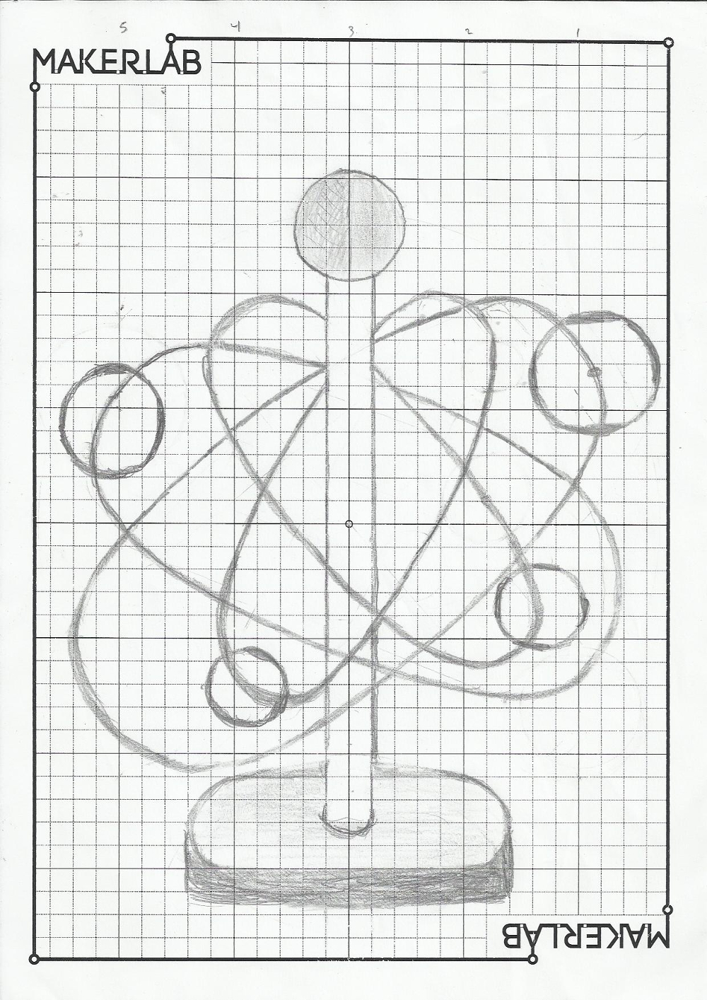

# Διαφορές Ηλιοκεντρικού και Γεωκεωτρικού μοντέλου

 Είναι γνωστό ότι στο ηλιοκεντρικό σύστημα, που ισχύει σήμερα, το κέντρο είναι ο Ήλιος, ενώ οι Γη και οι άλλοι πλανήτες περιφέρονται γύρω του. Μέχρι τον 15ο αιώνα, η θεωρία που ίσχυε βασιζόταν στο γεωκεντρικό μοντέλο στο οποίο υπήρχε η υπόθεση ότι το κέντρο είναι η Γη, με τον Ήλιο και τους πλανήτες να περιφέρονται γύρω της.

**Ιστορικά:** 

 Ο Αρίσταρχος ο Σάμιος (320-230 π.Χ) στην ελληνική αρχαιότητα ήταν υποστηρικτής του ηλιοκεντρικού συστήματος η θεωρία ομως αυτή καλύφτηκε από την επιβλητική μορφή του Αριστοτέλη (384-322 π.Χ), που θεμελίωσε το γεωκεντρικό σύστημα στο “Περί ουρανού” συγγραμμά του. Μάλιστα δε ο Κλαύδιος Πτολεμαίος (108-168 μ.Χ), το 2ο αιώνα μ.Χ, συστηματοποίησε ακόμη περισσότερο το σύστημα αυτό με τους “επικύκλους” του, ώστε αιώνες ολόκληρους, αργότερα, δεν μπορούσε κανένας να τον αμφισβητίσει. Με ελάχιστες αποκλίσεις από τα πραγματικά αποτελέσματα (και με μέθοδο παρόμοια με αυτή του Κέπλερ) δεν μπορούσε κανείς να τον αμφισβητήσει για τουλάχιστον 14 αι. Μόλις το 15ο μ.Χ αιώνα ο Πολωνός μοναχός Νικόλαος Κοπέρνικος στο έργο του «Έξι Βιβλία για τις περιστροφές των ουράνιων σφαιρών» παρουσιάζει ένα τροποποιημένο σύστημα από αυτό του Κλαύδιου Πτολεμαίου όπου ο Ήλιος βρίσκεται ακλόνητος στο κέντρο και γύρω του περιφέρονται 8 πλανήτες οι 6 από αυτούς είχαν την θέση που γνωρίζουμε και σήμερα.Έτσι λίγο αργότερα ο Γαλιλαίος Γαλιλέι (1564-1624) έστρεψε το τηλεσκοπικό κυάλι προς τα ουράνια σώματα και παρατήρησε την περιφορά της Σελήνης γύρω από την Γη καθώς και τους δορυφόρους του Δία και επαλήθευσε τις παρατηρήσεις των προγενέστερων μελετητών και τέλος ο διάσημος αστρονόμος Γιοχάνες Κέπλερ(1571-1630 μ.Χ)  εδραίωσε με τους Τρεις Νόμους του το ηλιοκεντρικό μοντέλο που γνωρίζουμε στις μέρες μας.  

**Σχέδιο μακέτας:**

 

**Παρουσίαση project:**

 Σκοπός του project είναι να προσομοιωθούν τα δύο μοντέλα (γεωκεντρικό και ηλιοκεντρικό) καταλλήγοντας σε μία σύγκριση μεταξύ τους και στην κατάρριψη της υπόθεσης του γεωκεντρικού συστήματος. 
Η μακέτα θα προσομοιώνει την κίνηση των πλανητών σε δύο διαφορετικά συστήματα, ηλιοκεντρικό και γεωκεντρικό.

 Το ηλεκτρονικό μέρος της μακέτας θα απαρτίζεται από 4 κινητήρες dc οι οποίοι θα είναι υπεύθυνοι για την κυκλική κίνηση των ουράνιων σωμάτων και 4 κινητήρες servo οι οποίοι θα είναι υπεύθυνοι για την ελλειπτικοποίηση της τροχιάς που αφορά μόνο το ηλιοκεντρικό μοντέλο.

Για το κομμάτι της εκτέλεσης των εντολών θα χρειαστούν 2 πλακέτες dwenguino όπου σε αυτές θα προγραμματιστούν οι εντολές της κίνησης.

 Θα χρειαστούν επίσης καλώδια για τροφοδότηση ρεύματος και φώτα led για το στιλιστικό κομμάτι.Το κύριο σώμα της μακέτας θα αποτελείται από μια γερή βάση σε άξονα (x’x) και ένα διαμπερές σωλήνα σε άξονα (z’z). 

 Κύριος στόχος μας είναι μέσα από την προσομοίωση του ηλιοκεντρικού μοντέλου να μπορέσουμε να αναδείξουμε την φαινόμενη κίνηση (γνωστή στο γεωκεντρικό μοντέλο ως ανάδρομη) των πλανητών με σημείο αναφοράς τη Γη. Έτσι, μπορεί να αποδειχθεί ότι οι παρατηρήσεις των αστροπαρατηρητών του 15ου αιώνα, οι οποίοι πίστευαν ότι η περίεργη αυτή κίνηση οφειλόταν στην αλλαγή της φοράς του εκάστοτε πλανήτη, έρχονται σε αντίθεση με την επικρατούσα επιστημονικά τεκμηριωμένη άποψη βασισμένη στο ηλιοκεντρικό μοντέλο ότι αυτή η κίνηση συμβαίνει λόγω μιας απλής προσπέρασης της Γης  σε έναν εξωτερικό πλανήτη ή αντίστοιχα η προσπέραση ενός εσωτερικού πλανήτη ως προς τη Γη.

**Διάγραμμα:**

<table>
<tr>
<td>    ΥΛΙΚΑ   </td>
<td>  ΤΙΜΕΣ  </td>
</tr>
<tr>
<td>4ης dc</td>
<td>60 &euro; </td>
</tr>
<tr>
<td>4ης servo </td>
<td>60 &euro;</td>
</tr>
<tr>
<td>2 dwenguino </td>
<td>60 &euro; </td>
</tr>
<tr>
<td>Συνολικό Κόστος</td>
<td>180 &euro;</td>
</tr> 
</table>
